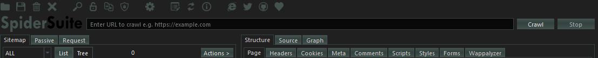
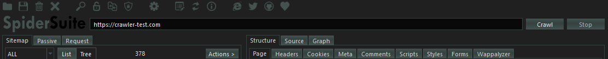
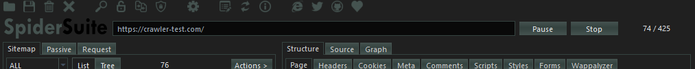
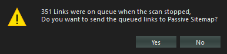
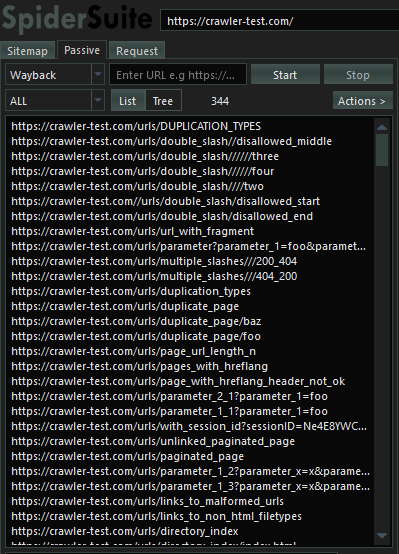

The crawl phase of a scan involves navigating around the target web application, following links and submitting forms to catalog the content of the entire target web application and the navigational paths within it to create an accurate map of the target web application.

## **Features Supported by Spider Suite Crawler**

* HTTP 1 and HTTP 2

Spider Suite supports crawling with both `http1` and `http2` and the user can configure which protocal to use for the particular crawl.

It is highly recommended to use `http2` for crawling if the target server supports it due to its advantages of speed and efficiency.

* Only static crawling is supported for now.

Spider Suite version 1.0.0 only supports static crawling of pages meaning it can only crawl links it statically finds in the page no page manipulation or dynamic loading of pages for crawling is supported for now.

## **Crawling from a Single Link**
Spider Suite can crawl an entire target web application from a single link which acts as the root entry page for target web application.

To start crawling requires you to follow the following simple and few procedures.

* **Input the target link**

The Target input box

Add the target input to the input box of Spider Suite.

_**Few things to Note:**_

Always make sure that you have input a valid url with its protocal/schema.
    
    - Valid Links are:
         https://example.com
         https://example.com/
         https://example.com/path1/path2
         https://example.com:443/path1
         https://127.0.0.1:80

    - Invalid Links are:
        example.com
        https://example/
        https://example.com?param1=value1&param2=value2

* **Configure the crawler**

Next step is to set the configurations for the crawler to run on.

`This is a very crucial step` as the performance and success of the crawler depends on the configurations you have set. Take time to study the effects of all the [Configrations](Configurations).

Click the  (`config action`) on the toolbar to get access to the configuration dialog where you can set preferred configurations.

The configurations that affect the crawler are:

`Limits:` Sets all the limitations for the crawler

`Crawler:` Sets all the essesntial crawler configurations

`Headers:` Sets the http request headers to be used by the crawler request.

`Input Fields:` Sets the values for the page's input fields for automatic filling and submition.

`Exclusion:` Sets the paths, cookies, file extensions and url parameters to be excluded for the crawl.

`Authentication:` Sets values for automatic authentication by the crawler.

`Proxy:` Sets the proxy address and port where all crawl request will pass through.

* **Start Crawler**

Start the crawler by clicking on the `Crawl` button and the crawler with immediately start crawling the target web application.

After starting the crawler, you can observer the crawler's `progress` on the far right corner which shows the number of pages crawled per all the pages available:

progress = <pages_crawled> / <total_pages>.

After crawler has started you have options to `pause` or `stop` the crawler.

* **Pause Crawler**

Spider Suite allows you to pause the crawler at any point during crawling and for any duration of time by pressing the `Pause` button.

After pressing `Pause` button the crawler immediately pauses sending the requests to the server or processing new replies `but` all the already finished and processed pages will still be added to the sitemap, so its not uncommon to pause the crawler and still seeing a few pages being added to the sitemap.

* **Resume Crawler**

After pausing the crawler you can resume crawling by pressing the `Resume` button and the crawler will immediately resume crawling the target web pages where it left of.

* **Stop Crawler**

You can stop the crawler at any point in time by pressing the `Stop` button. Stopping the crawler means that you terminate the crawler and you can no longer resume that particular crawl, all resources allocated are cleaned hence you can only start afresh from there.

After pressing `Stop` button the crawler immediately stops sending the requests to the server `but` it will wait untill all the already sent request to be processed and added to the sitemap before it kills all the crawler threads. So its not uncommon to stop the crawler and still seeing a few pages being added to the sitemap as it will wait for all responses from the target server to be processed.

After stopping the crawler you may be prompted to save all the remaining target links that had'nt been crawled yet.

If you accept all the pending links will be added to the passive crawler tab.

If you deny all the pending links will be discarded.

## **Crawling a Target with Seed**
Crawling a target with seed

## **Crawling a constant number of Links**
Spider Suite has the ability to crawl(fetch) a list of url links and present the successfully fetched pages.

## **TroubleShooting the Crawler**